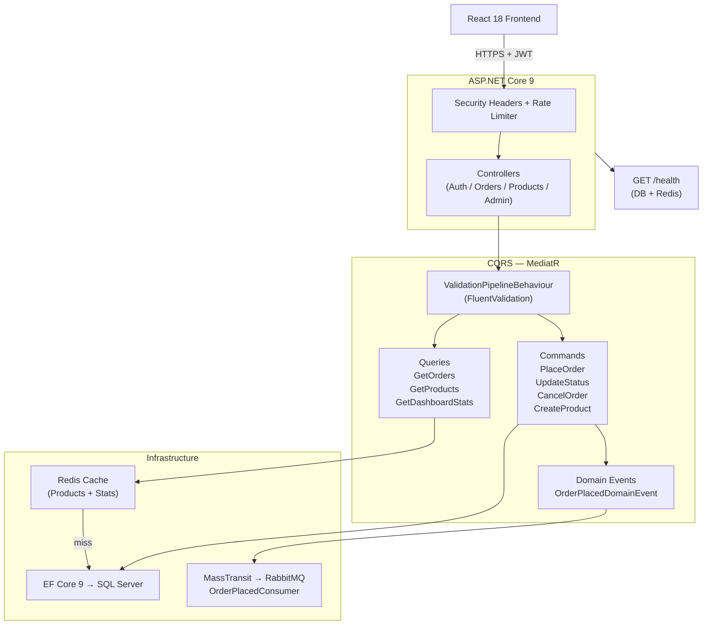

## ?? Live Demo

**Frontend:** https://orderflow-swapnil.netlify.app

---

# OrderFlow — CQRS Order Management System

[](https://github.com/SwapnilPhuke/OrderFlow/actions/workflows/ci.yml)
[](https://dotnet.microsoft.com/)
[](https://reactjs.org/)
[](LICENSE)

A production-ready, full-stack **order management system** built with **.NET 9** and **React 18**, showcasing CQRS with MediatR, Redis caching, RabbitMQ messaging, Clean Architecture, and integration/unit tests.

---

## ✨ Features

| Feature | Details |
|---|---|
| **CQRS + MediatR** | Commands (write) and Queries (read) fully separated; Pipeline Behaviour for FluentValidation |
| **Clean Architecture** | Domain → Application → Infrastructure → API; zero leaky abstractions |
| **JWT + Refresh Tokens** | 15-min access tokens; 7-day rotating refresh tokens; BCrypt password hashing |
| **Role-Based Access Control** | `Customer` / `Admin` roles; `AdminOnly` policy on admin endpoints |
| **Product Catalogue** | Paginated, searchable, category-filtered product listing; Redis-cached query results |
| **Order Management** | Place, view, update status, cancel orders; server-side pagination |
| **Redis Caching** | Product queries + dashboard stats cached with 5-min TTL; cache invalidated on writes |
| **RabbitMQ + MassTransit** | `OrderPlacedIntegrationEvent` published on every new order; consumer simulates email confirmation |
| **Dashboard Stats** | Admin dashboard: total orders, revenue, status breakdown, product/stock counts |
| **Rate Limiting** | 100 req / min per IP (System.Threading.RateLimiting) |
| **Security Headers** | CSP, X-Frame-Options, X-Content-Type-Options on every response |
| **Health Checks** | `GET /health` — reports DB + Redis status |
| **API Versioning** | All routes under `/api/v1` (Asp.Versioning.Mvc) |
| **FluentValidation** | Declarative validators wired via MediatR pipeline behaviour |
| **AutoMapper** | Zero-boilerplate DTO ↔ entity mapping |
| **Serilog** | Structured logging with console + rolling-file sinks |
| **Docker Ready** | Single `docker-compose up` starts API + Frontend + SQL Server + Redis + RabbitMQ |
| **CI/CD** | GitHub Actions: build + test on every push |
| **Integration Tests** | WebApplicationFactory tests covering auth + protected endpoints |
| **Unit Tests** | PlaceOrderCommandHandler — happy path, missing product, insufficient stock |

---

## 🏗️ Architecture



---

## 🛠️ Tech Stack

### Backend
| | |
|---|---|
| Framework | .NET 9 / ASP.NET Core Web API |
| Pattern | Clean Architecture + CQRS (MediatR 12) |
| ORM | Entity Framework Core 9 |
| Database | SQL Server |
| Cache | Redis (StackExchange.Redis) |
| Messaging | MassTransit 8 + RabbitMQ |
| Auth | JWT Bearer (15 min) + Refresh Token (7 days) + BCrypt |
| Validation | FluentValidation 11 via MediatR Pipeline Behaviour |
| Mapping | AutoMapper 12 |
| Versioning | Asp.Versioning.Mvc — `/api/v1` |
| Rate Limiting | System.Threading.RateLimiting — 100 req/min/IP |
| Logging | Serilog (console + rolling file) |

### Frontend
| | |
|---|---|
| Library | React 18 + Hooks |
| Routing | React Router DOM v6 |
| HTTP | Axios with 401 → auto-refresh interceptor |
| State | Context API (AuthProvider) |
| Tests | React Testing Library + Jest |

---

## 📋 Prerequisites

- [.NET 9 SDK](https://dotnet.microsoft.com/download)
- [SQL Server](https://www.microsoft.com/en-us/sql-server/) (or Docker)
- [Redis](https://redis.io/) (or Docker)
- [RabbitMQ](https://www.rabbitmq.com/) (or Docker)
- [Node.js 20+](https://nodejs.org/)
- [Docker & Docker Compose](https://docs.docker.com/get-docker/) *(recommended)*

---

## 🚀 Quick Start

### Option A — Docker (recommended, starts everything)

```bash
git clone https://github.com/SwapnilPhuke/OrderFlow.git
cd OrderFlow

# Copy and configure environment
cp .env.example .env
# Edit .env — set DB_PASSWORD and JWT_SECRET_KEY

# Start all 5 services
docker-compose up --build
```

| Service | URL |
|---|---|
| Frontend | http://localhost:3000 |
| API + Swagger | http://localhost:5000/swagger |
| RabbitMQ Management | http://localhost:15672 (guest/guest) |
| Health Check | http://localhost:5000/health |

**Default admin:** `admin` / `Admin@123456`

---

### Option B — Manual Setup

#### Backend

```bash
cd backend

# Set JWT secret
$env:JwtSettings__SecretKey = "your-secret-key-min-32-chars"

# Restore + migrate + run
dotnet restore OrderFlow.sln
dotnet ef database update --project src/OrderFlow.Infrastructure --startup-project src/OrderFlow.API
dotnet run --project src/OrderFlow.API
# → http://localhost:5000
```

#### Frontend

```bash
cd frontend
npm install
# Create .env with: REACT_APP_API_URL=http://localhost:5000
npm start
# → http://localhost:3000
```

---

## 📚 CQRS Pattern Explained

```
HTTP Request
    │
    ▼
Controller            ← thin, no business logic
    │  sends Command or Query via IMediator.Send()
    ▼
Pipeline Behaviour    ← FluentValidation runs here
    │
    ▼
Handler               ← all business logic lives here
    ├── Commands       write operations (PlaceOrder, UpdateStatus, etc.)
    │       └── publishes Domain Events → Integration Events → RabbitMQ
    └── Queries        read operations (GetOrders, GetProducts, etc.)
            └── checks Redis cache first, falls back to EF Core
```

---

## 📡 API Reference

| Method | Endpoint | Auth | Description |
|---|---|---|---|
| POST | `/api/v1/auth/register` | ✗ | Create account |
| POST | `/api/v1/auth/login` | ✗ | Login — returns token + refreshToken |
| POST | `/api/v1/auth/refresh` | ✗ | Rotate refresh token |
| POST | `/api/v1/auth/logout` | ✓ | Revoke refresh token |
| GET | `/api/v1/products` | ✗ | List products (cached, paginated, searchable) |
| GET | `/api/v1/products/{id}` | ✗ | Get product |
| POST | `/api/v1/products` | Admin | Create product |
| GET | `/api/v1/orders` | ✓ | List my orders (admin sees all) |
| GET | `/api/v1/orders/{id}` | ✓ | Get order |
| POST | `/api/v1/orders` | ✓ | Place order |
| PUT | `/api/v1/orders/{id}/status` | ✓ | Update status |
| DELETE | `/api/v1/orders/{id}` | ✓ | Cancel order |
| GET | `/api/v1/admin/stats` | Admin | Dashboard statistics |
| GET | `/health` | ✗ | DB + Redis health |

---

## 🧪 Running Tests

```bash
# Backend — unit + integration tests (no SQL Server or Redis needed)
cd backend
dotnet test OrderFlow.sln -v normal

# Frontend — component tests
cd frontend
npm test -- --watchAll=false
```

---

## 🐳 Docker Commands

```bash
docker-compose up --build     # start all services
docker-compose up -d          # detached mode
docker-compose down           # stop
docker-compose down -v        # stop + wipe database volume
```

---

## 🚢 Deployment (Azure)

```bash
# Backend — Azure App Service
az webapp config appsettings set \
  --resource-group MyRG --name orderflow-api \
  --settings \
    "ConnectionStrings__DefaultConnection=<azure-sql-connstr>" \
    "JwtSettings__SecretKey=<secret>" \
    "Redis__ConnectionString=<redis-connstr>"

# Frontend — Azure Static Web Apps or Vercel
# Set REACT_APP_API_URL=https://orderflow-api.azurewebsites.net
```

